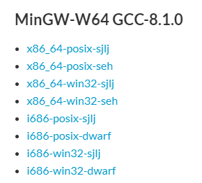
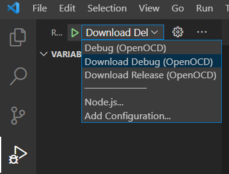
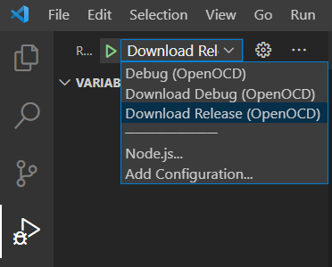
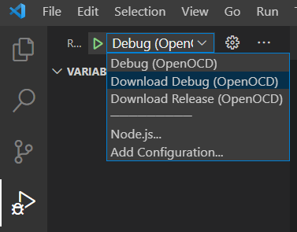
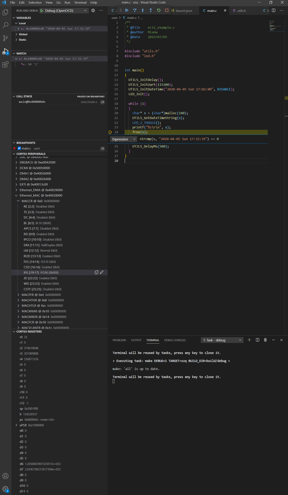

# 搭建VSCODE下STM34F4标准库开发环境

## 前置要求

x86电脑，Windows 10，被`KEIL`搞崩心态的人，版本管理工具GIT（64位）

## 安装VSCODE

官方网站：https://code.visualstudio.com/

自行下载安装，只要在满的电脑上能native运行，什么版本都可以

> 如果你是在这个文档出来不久访问官网的话，可能还能看到主页上图标为电灯泡的IntelliSense的宣传，留意一下这个插件，后面我们会用到，但是现在在这里先别点进去。

打开Vscode，安装下面这些扩展

- ARM 作者dan-c-underwood
- C/C++ 作者Microsoft
- Cortex-Debug 作者marus25
- Linker Script 作者amapleaf
- Visual Studio IntelliCode 作者Microsoft

## 安装交叉编译工具链

因为用GPLv3协议开源这篇文章，因此只能以官网链接的形式提供所需交叉编译器：

https://developer.arm.com/tools-and-software/open-source-software/developer-tools/gnu-toolchain/gnu-rm/downloads

下载还挺顺利的，如果卡顿，顺路到其他国家的时候再下载。如果哪天这个链接失效了，可以提issue哦

选择`Windows 32-bit ZIP package`版本，`Windows 32-bit Installer`当然也可以，只不过这里以前者为例。

另外有一家的编译器看起来不错，只是也没试过：

https://releases.linaro.org/components/toolchain/binaries/

1. 解压刚才下载的`gcc-arm-none-eabi-10-2020-q4-major-win32.zip`，因为版本不同，也许命名有些不同，主要是`10-2020-q4`这一段不太一样，这没有关系。
2. 把解压出来的东西复制到永久存放它的地方并改个短点的文件夹名`C:\ProgramData\gcc-arm-none`

3. 记住你要用的编译工具链在这里`C:\ProgramData\gcc-arm-none\bin`
4. 实际上，只需要保留`C:\ProgramData\gcc-arm-none\bin`和`C:\ProgramData\gcc-arm-none\lib\gcc\arm-none-eabi\10.2.1\include`即可，但不建议这样做

## 安装make工具

我们用GNU的make工具来执行编译，搞嵌入式linux的小伙伴一定很熟悉

可是Windows上哪有make啊，不急，有个东西叫Mingw

https://sourceforge.net/projects/mingw-w64/

点Files标签，往下翻页面，找到如下的样子



在这里选x86_64-posix-seh下载得到`x86_64-8.1.0-release-posix-seh-rt_v6-rev0.7z`，当然你的版本和这里的也许不一样，文件名就有点不同啦。

1. 解压得到文件夹`mingw64`
2. make工具就是这个`mingw64\bin\mingw32-make.exe`，给他改个名，就叫`make.exe`
3. 假设你的Git是装在这里的`C:\Program Files\Git`，那么把刚才的`make.exe`复制到这里`C:\Program Files\Git\mingw64\bin`

4. 第3步是为了可以在git bash里调用make，快试一试把

   ```bash
   $ make -v
   GNU Make 4.2.1
   Built for i686-w64-mingw32
   Copyright (C) 1988-2016 Free Software Foundation, Inc.
   License GPLv3+: GNU GPL version 3 or later <http://gnu.org/licenses/gpl.html>
   This is free software: you are free to change and redistribute it.
   There is NO WARRANTY, to the extent permitted by law.
   ```

这波下载和解压很费时间，因此这个库的release里会提供`make.exe`，但这是Mingw项目编译的GNU的`make`，这里只是原样（AS IS的意思）提供。

## 安装OpenOCD

OpenOCD是一个嵌入式调试工具，详细介绍自行查找，总之，好用的很，官网没有提供Windows可用的发布版本。所以找到了gnu工具链的网站：

https://gnutoolchains.com/arm-eabi/openocd/

这里下载了`openocd-20210729.7z`，当然，我们用的版本可以不一致。

1. 老套路，解压并改名`openocd`
2. 放到永久存放的文件夹，这里放到了`C:\ProgramData\openocd`

3. 记住，openocd可执行文件在这里`C:\ProgramData\openocd\bin`

> 如果还没有安装stlink驱动，可以运行`C:\ProgramData\openocd\drivers\ST-Link\dpinst_amd64.exe`来安装。另外留意下，`C:\ProgramData\openocd\share\openocd\scripts\stlink.cfg`和`C:\ProgramData\openocd\share\openocd\scripts\target\stm32f4x.cfg`文件，后面会再见到他们。

## 建立工程

以我自己的库[MWLib](https://github.com/3703781/MWLib)为工程模板

### 创建配置

新建`.vscode`文件夹，下面的操作都在这个文件夹下进行

1. 新建`settings.json`

   - terminal.integrated.shell.windows 指定vscode用git里的bash作为集成的命令窗口
   - terminal.external.windowsExec 指定vscode用git里的bash作为集成的命令窗口
   - cortex-debug.armToolchainPath 指定gdb、objdump等工具所在路径
   - cortex-debug.openocdPath 指定openocd可执行文件所在路径
   - files.encoding gbk是为了兼容keil，正确显示中文

   ```json
   {
       "terminal.integrated.shell.windows": "C:\\Program Files\\Git\\bin\\bash.exe",
       "terminal.external.windowsExec": "C:\\Program Files\\\\Git\\bin\\bash.exe",
       "cortex-debug.armToolchainPath": "C:\\ProgramData\\gcc-arm-none\\bin",
       "cortex-debug.openocdPath": "C:\\ProgramData\\openocd\\bin",
       "files.encoding": "gbk"
   }
   ```

2. 新建`c_cpp_properties.json`

   - `browse->path` 指定给vscode搜索跳转用的路径，除了本工程，还有gcc库文件位置

   - `includePaht` 指定vscode查找头文件用的路径

   - `defines` 指定预定义的宏

   - `compilerPath` 指定编译器可执行文件路径

     然鹅这些只是让vscode具有跳转、不乱标错、识别编译器报错的功能，与实际编译没有关系

   ```json
   {
       "configurations": [
           {
               "name": "Arm",
               "browse": {
                   "path": [
                       "${workspaceFolder}/**",
                     	"C:/ProgramData/gcc-arm-none/arm-none-eabi/include/**"
                   ],
                   "limitSymbolsToIncludedHeaders": true
               },
               "includePath": [
                   "${workspaceFolder}/**",
                   "C:/ProgramData/gcc-arm-none/arm-none-eabi/include/**"
               ],
               "defines": [
                   "__GNUC__=10",
                   "__GNUC_MINOR__=2",
                   "__GNUC_PATCHLEVEL__=1",
                   "__USES_INITFINI__",
                   "STM32F40_41xxx",
                   "USE_STDPERIPH_DRIVER",
                   "__FPU_USED",
                   "ARM_MATH_CM4"
               ],
               "compilerPath": "C:\\ProgramData\\gcc-arm-none\\bin",
               "cStandard": "c99",
               "cppStandard": "c++17",
               "intelliSenseMode": "gcc-arm"
           }
       ],
       "version": 4
   }
   ```

3. 新建`launch.json`

   一共建立了3个选项，名为`Debug (OpenOCD)`、`Download Debug (OpenOCD)`、`"Download Release (OpenOCD)"`。这三个选项可以在Run and Debug页面上方选择，分别代表`调试`、`下载Debug版本`、`下载Release版本`。

   `调试`会把Debug版本的程序烧写到STM32上，然后启动GDB，有openocd作为gdb和调试器stlink间的桥梁，在vscode中则可图形化地操作GDB，也就是显示出调试界面。由`preRestartCommands`、`postRestartCommands`、`preLaunchCommands`可知，启动后会执行main函数调用前的代码并停留在main函数处。熟悉GDB的小伙伴一定不陌生，当然也可以自己改改这些指令。`下载Debug版本`是和Makefile配合起来的，实际上调用了`task.json`中的标签为`debug`的任务，这个任务给make传入了`DEBUG=1`的参数。编译完成后，将程序下载到STM32上。`下载Release版本`和`下载Debug版本`一样，只不过调用的`release`任务给make传入`DEBUG=0`参数。

   前面提到的openocd中的`stlink.cfg`和`stm32f4x.cfg`在每个选项的`configFiles`里指定了调试器型号和MCU型号。如果你用的其他调试器比图jlink、dap，就对应修改`interface/stlink.cfg`这一项，其他调试仿真器cfg文件在前面已经提到在哪了，去里面找找就知道该怎么设置了。

   - `interface` 指调试器连接MCU的接口类型，这里选的SWD接口，也可选为其他接口。
- `svdFile`  指系统视图描述文件，用于描述各寄存器和存储资源，调试过程中可以直接对外设寄存器和内存进行访问就靠它。最直观的意思就是只有正确对应设备的svd文件才能让你在调试界面左下角看到正确的寄存器。实际上没有这个文件连开始调试都不可能。
   - `servertype` 自然是openocd，这种类型的调试会被交给Cortex-Debug插件来处理。因为下面有一句`type`指定了使用Cortex-Debug。
   - `type` 指定实际处理的插件，vscode会把当前配置交给那个插件。`servertype`则是给插件来判断具体类型的。
   - `executable` 编译生成的可下载的二进制文件，elf格式，就是可包含ELF头部、程序头部、节和节头部的那种格式。
   - `runToMain` 是否在main函数的第一句停下。
   - `device` 指定MCU的型号

   ```json
   {
       "version": "0.2.0",
       "configurations": [
           {
               "name": "Debug (OpenOCD)",
               "cwd": "${workspaceRoot}",
               "configFiles": [
                   "interface/stlink.cfg",
                   "target/stm32f4x.cfg"
               ],
               "device": "STM32F407VE",
               "interface": "swd",
               "preLaunchTask": "debug",
               "request": "launch",
               "runToMain": true,
               "servertype": "openocd",
               "executable": "build/debug/${workspaceRootFolderName}.elf",
               "svdFile": "core/STM32F407.svd",
               "type": "cortex-debug",
               "preRestartCommands": [
                   // "file build/debug/${workspaceRootFolderName}.elf",
                   // "load",
                   // "monitor reset",
                   // "enable breakpoint",
                   // "b main"
               ],
               "postRestartCommands": [
                   // "c"
               ],
               "preLaunchCommands": [
                   // "file build/debug/${workspaceRootFolderName}.elf",
                   // "monitor reset",
                   // "monitor halt",
                   // "load",
                   // "enable breakpoint",
                   // "b main"
               ],
               "postLaunchCommands": [
                   // "c"
               ]
           },
           {
               "name": "Download Debug (OpenOCD)",
               "cwd": "${workspaceRoot}",
               "configFiles": [
                   "interface/stlink.cfg",
                   "target/stm32f4x.cfg" 
               ],
               "device": "STM32F407VE",
               "interface": "swd",
               "preLaunchTask": "debug",
               "request": "launch",
               "runToMain": false,
               "servertype": "openocd",
               "executable": "build/debug/${workspaceRootFolderName}.elf",
               "svdFile": "core/STM32F407.svd",
               "type": "cortex-debug",
               "preLaunchCommands": [
                   "file build/debug/${workspaceRootFolderName}.elf",
                   "load",
                   "monitor reset",
                   "q"
               ]
           },
           {
               "name": "Download Release (OpenOCD)",
               "cwd": "${workspaceRoot}",
               "configFiles": [
                   "interface/stlink.cfg",
                   "target/stm32f4x.cfg"
               ],
               "device": "STM32F407VE",
               "interface": "swd",
               "preLaunchTask": "release",
               "request": "launch",
               "runToMain": false,
               "servertype": "openocd",
               "executable": "build/release/${workspaceRootFolderName}.elf",
               "svdFile": "core/STM32F407.svd",
               "type": "cortex-debug",
               "preLaunchCommands": [
                   "file build/release/${workspaceRootFolderName}.elf",
                   "load",
                   "monitor reset",
                   "q"
               ]
           }
       ]
   }
   ```

4. 新建`tasks.json`

   用vscode的人哪会看不懂下面这段，就不过多解释了。总之就是`编译调试版本`、`编译发布版本`、`清除编译结果`三个功能。三个指令会分别交给make，由Makefile描述的那样判断是全部编译还是部分编译后再链接。至于编译后的结果怎么保存之类的，看传给make的`BUILD_DIR`参数，`debug`版本会在`build/debug`下，`release`版本会在`build/release`下。而目标名称为工程文件夹名。

   ```json
   {
   	"version": "2.0.0",
   	"tasks": [
   		{
   			"type": "shell",
   			"label": "debug",
   			"command": "make",
   			"args": [
   				"DEBUG=1",
   				"TARGET=${workspaceRootFolderName}",
                   "BUILD_DIR=build/debug"
   			],
   			"group": {
   				"kind": "build",
   				"isDefault": true
   			},
   			"problemMatcher": [
   				"$gcc"
   			]
   		},
   		{
   			"type": "shell",
   			"label": "release",
   			"command": "make",
   			"args": [
   				"DEBUG=0",
   				"TARGET=${workspaceRootFolderName}",
                   "BUILD_DIR=build/release"
   			],
   			"group": {
   				"kind": "build",
   				"isDefault": true
   			},
   			"problemMatcher": [
   				"$gcc"
   			]
   		},
   		{
   			"type": "shell",
   			"label": "clean",
   			"command": "make",
   			"group": {
   				"kind": "build",
   				"isDefault": true
   			},
   			"args": [
   				"clean",
   				"TARGET=${workspaceRootFolderName}",
                   "BUILD_DIR=build"
   			],
   			"problemMatcher": []
   		}
   	]
   }
   ```

### 添加工程文件

1. 在工程中的`core`目录下放入GNU版本的启动文件`startup_stm32f407xx.s`，意思就是原来的ARMCC版启动文件删掉换成这里给的。
2. 在工程中的`core`目录下放入系统视图文件`STM32F407.svd`和链接脚本`STM32F407VETx_FLASH.ld`
下面说说启动文件、视图文件、链接脚本哪里来的
- 我们借用了CubeMX用的包：
https://github.com/STMicroelectronics/STM32CubeF4
下载后解压得到文件夹`STM32Cube_FW_F4_V1.26.0`，你的版本和这里不同，名称也有所不同，改个名字`stm32cubef4`。启动文件在`stm32cubef4\Drivers\CMSIS\Device\ST\STM32F4xx\Source\Templates\gcc`目录下。
- 借用ttinygo-org的stm32-svd项目：
https://github.com/tinygo-org/stm32-svd
Clone后得到文件夹`stm32-svd`，视图文件在`stm32-svd\svd`里。
- 借用CubeMx软件生成链接脚本

3. 在工程根目录下放入`Makefile`文件，`Makefile`文件是从CubeMX改来的的

   Makefile文件，懂得都懂

```makefile
######################################
# target
######################################
TARGET ?= MWLib


######################################
# building variables
######################################
# debug build?
DEBUG = 1
# optimization
ifeq ($(DEBUG), 1)
OPT = -Og
else
OPT = -O3
endif


#######################################
# paths
#######################################
# Build path
BUILD_DIR ?= build/release

######################################
# source
######################################
# C sources
C_SOURCES =  \
fwlib/misc.c \
fwlib/stm32f4xx_adc.c \
fwlib/stm32f4xx_can.c \
fwlib/stm32f4xx_crc.c \
fwlib/stm32f4xx_cryp_aes.c \
fwlib/stm32f4xx_cryp_des.c \
fwlib/stm32f4xx_cryp_tdes.c \
fwlib/stm32f4xx_cryp.c \
fwlib/stm32f4xx_dac.c \
fwlib/stm32f4xx_dbgmcu.c \
fwlib/stm32f4xx_dcmi.c \
fwlib/stm32f4xx_dma.c \
fwlib/stm32f4xx_dma2d.c \
fwlib/stm32f4xx_exti.c \
fwlib/stm32f4xx_flash_ramfunc.c \
fwlib/stm32f4xx_flash.c \
fwlib/stm32f4xx_gpio.c \
fwlib/stm32f4xx_hash_md5.c \
fwlib/stm32f4xx_hash_sha1.c \
fwlib/stm32f4xx_hash.c \
fwlib/stm32f4xx_i2c.c \
fwlib/stm32f4xx_iwdg.c \
fwlib/stm32f4xx_ltdc.c \
fwlib/stm32f4xx_pwr.c \
fwlib/stm32f4xx_rcc.c \
fwlib/stm32f4xx_rng.c \
fwlib/stm32f4xx_rtc.c \
fwlib/stm32f4xx_sai.c \
fwlib/stm32f4xx_sdio.c \
fwlib/stm32f4xx_syscfg.c \
fwlib/stm32f4xx_tim.c \
fwlib/stm32f4xx_usart.c \
fwlib/stm32f4xx_wwdg.c \
fwlib/stm32f4xx_fsmc.c \
user/oled/oled.c \
user/bmp280.c \
user/bsp_iic.c \
user/drv8825.c \
user/e18d80nk.c \
user/ec11.c \
user/gp2y0e03.c \
user/hallencoder.c \
user/hcsr04.c \
user/key.c \
user/led.c \
user/valve.c \
user/beep.c \
user/gp2y1010.c \
user/main.c \
user/nrf24l01.c \
user/pid.c \
user/pms7003.c \
user/sd.c \
user/serialport.c \
user/servo.c \
user/si7021.c \
user/dht11.c \
user/mq7.c \
user/hcsr501.c \
user/xkcy25v.c \
user/stm32f4xx_it.c \
user/system_stm32f4xx.c \
user/tb6612fng.c \
user/utils.c \
fatfs/diskio.c \
fatfs/ff.c \
fatfs/ffsystem.c \
fatfs/ffunicode.c \
user/lcd/lcd.c
# user/mpu6050/inv_mpu_dmp_motion_driver.c
# user/mpu6050/inv_mpu.c
# user/mpu6050/mpu6050.c


# ASM sources
ASM_SOURCES =  \
core/startup_stm32f407xx_gnuc.s


#######################################
# binaries
#######################################
PREFIX = arm-none-eabi-
# The gcc compiler bin path can be either defined in make command via GCC_PATH variable (> make GCC_PATH=xxx)
# either it can be added to the PATH environment variable.
ifdef GCC_PATH
CC = $(GCC_PATH)/$(PREFIX)gcc
AS = $(GCC_PATH)/$(PREFIX)gcc -x assembler-with-cpp
CP = $(GCC_PATH)/$(PREFIX)objcopy
SZ = $(GCC_PATH)/$(PREFIX)size
else
CC = $(PREFIX)gcc
AS = $(PREFIX)gcc -x assembler-with-cpp
CP = $(PREFIX)objcopy
SZ = $(PREFIX)size
endif
HEX = $(CP) -O ihex
BIN = $(CP) -O binary -S
 
#######################################
# CFLAGS
#######################################
# cpu
CPU = -mcpu=cortex-m4

# fpu
FPU = -mfpu=fpv4-sp-d16

# float-abi
FLOAT-ABI = -mfloat-abi=hard

# mcu
MCU = $(CPU) -mthumb $(FPU) $(FLOAT-ABI)

# macros for gcc
# AS defines
AS_DEFS = 

# C defines
C_DEFS =  \
-DSTM32F40_41xxx \
-DUSE_STDPERIPH_DRIVER \
-D__FPU_USED \
-DARM_MATH_CM4


# AS includes
AS_INCLUDES = 

# C includes
C_INCLUDES =  \
-Icore \
-Ifatfs \
-Ifwlib \
-Iuser \
-Iuser/oled \
-Iuser/lcd


# compile gcc flags
ASFLAGS = $(MCU) $(AS_DEFS) $(AS_INCLUDES) $(OPT) -Wall -fdata-sections -ffunction-sections

CFLAGS = $(MCU) $(C_DEFS) $(C_INCLUDES) $(OPT) -Wall -fdata-sections -ffunction-sections

ifeq ($(DEBUG), 1)
CFLAGS += -g -gdwarf-2
endif


# Generate dependency information
CFLAGS += -MMD -MP -MF"$(@:%.o=%.d)"


#######################################
# LDFLAGS
#######################################
# link script
LDSCRIPT = core/STM32F407VETx_FLASH.ld

# libraries
LIBS = -lc -lm -lnosys
LIBDIR = 
LDFLAGS = $(MCU) -specs=nano.specs -T$(LDSCRIPT) $(LIBDIR) $(LIBS) -Wl,-Map=$(BUILD_DIR)/$(TARGET).map,--cref -Wl,--gc-sections


#######################################
# build the application
#######################################
# list of objects
OBJECTS = $(addprefix $(BUILD_DIR)/,$(notdir $(C_SOURCES:.c=.o)))
vpath %.c $(sort $(dir $(C_SOURCES)))
# list of ASM program objects
OBJECTS += $(addprefix $(BUILD_DIR)/,$(notdir $(ASM_SOURCES:.s=.o)))
vpath %.s $(sort $(dir $(ASM_SOURCES)))

# default action: build all
all: $(BUILD_DIR)/$(TARGET).elf $(BUILD_DIR)/$(TARGET).hex $(BUILD_DIR)/$(TARGET).bin
	

$(BUILD_DIR)/%.o: %.c Makefile | $(BUILD_DIR) 
	$(CC) -c $(CFLAGS) -Wa,-a,-ad,-alms=$(BUILD_DIR)/$(notdir $(<:.c=.lst)) $< -o $@

$(BUILD_DIR)/%.o: %.s Makefile | $(BUILD_DIR)
	$(AS) -c $(CFLAGS) $< -o $@

$(BUILD_DIR)/$(TARGET).elf: $(OBJECTS) Makefile
	$(CC) $(OBJECTS) $(LDFLAGS) -o $@
	$(SZ) $@

$(BUILD_DIR)/%.hex: $(BUILD_DIR)/%.elf | $(BUILD_DIR)
	$(HEX) $< $@
	
$(BUILD_DIR)/%.bin: $(BUILD_DIR)/%.elf | $(BUILD_DIR)
	$(BIN) $< $@	
	
$(BUILD_DIR):
	if [ ! -d $(BUILD_DIR) ]; then mkdir -p $@; fi		

#######################################
# clean up
#######################################
clean:
	-rm -fR $(BUILD_DIR)
  
#######################################
# dependencies
#######################################
-include $(wildcard $(BUILD_DIR)/*.d)
```

## 修改不兼容的代码

MWLib原库是基于ARMCC编译工具链的，有的语法是GNU不能兼容的

1. `utils.c`

   这个文件的2.0版本已兼容GNU的stdout重定向

2. `sd.c`

   这个文件的1.0版本已兼容GNU的字节对齐

## 使用

### 编译并烧写运行

1. `debug`版本

   在`Run and Debug`页面运行`Download Debug (OpenOCD)`即可

   

2. `release`版本

   在`Run and Debug`页面运行`Download Release (OpenOCD)`即可

   

### 编译并烧写调试

在`Run and Debug`页面运行`Debug (OpenOCD)`即可



与普通PC本地调试不同的是，面板上会出现`CORTEX PERIPHERALS`和`CORTEXREGISTERS`，点击对应寄存器右边的🖊图标可以实时修改寄存器的值。




### 仅编译

1. `debug`版本

   Terminal->Run Task->选择debug

2. `release`版本

   Terminal->Run Task->选择release

### 清除生成的文件

Terminal->Run Task->clean


## 致谢

参考资料和文献很多，本文作者懒所以就不一一列出了，这里同一致谢。没被谢到的请自己代表本文作者感谢自己。

- 感谢必应、百度、谷歌
- 感谢微软、Vscode扩展开发者dan-c-underwood、marus25、amapleaf
- 感谢GNU相关开发者和社区、意法半导体MCD团队
- 感谢Github上的ttinygo-org
- 感谢Github上MwLib库的作者我自己
- 感谢ARM写出我能看懂的内核开发手册、编译手册
